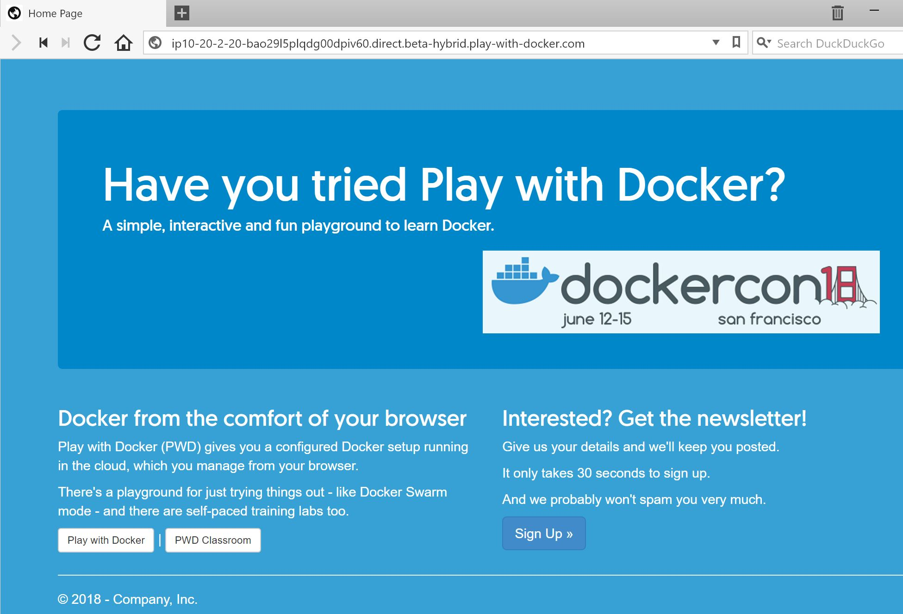
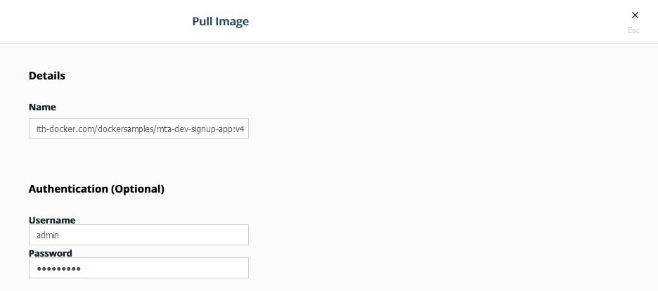
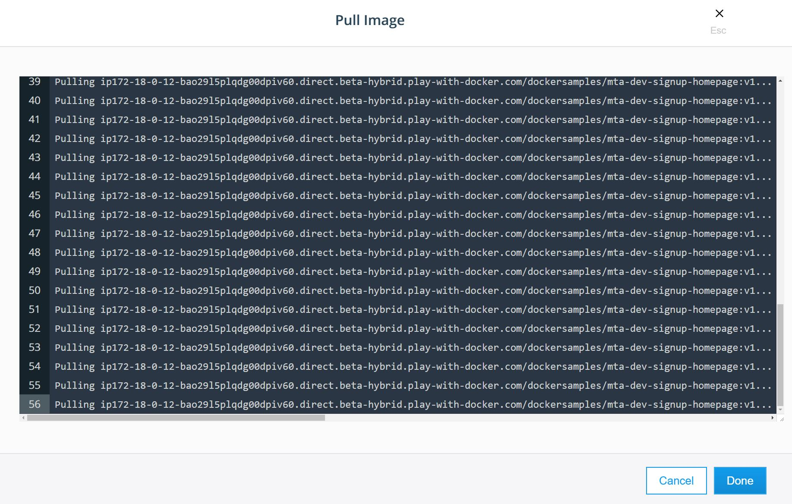
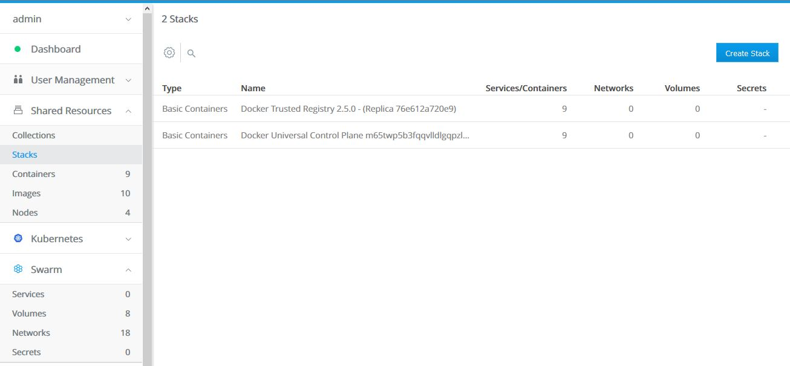
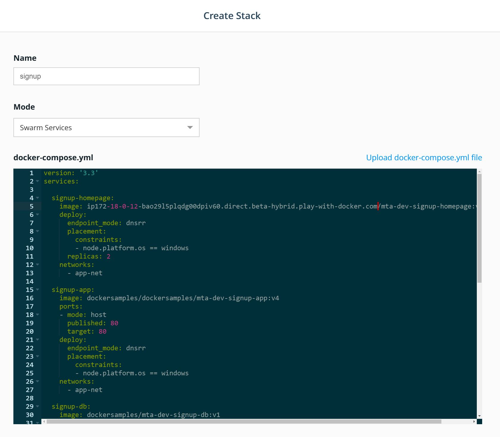
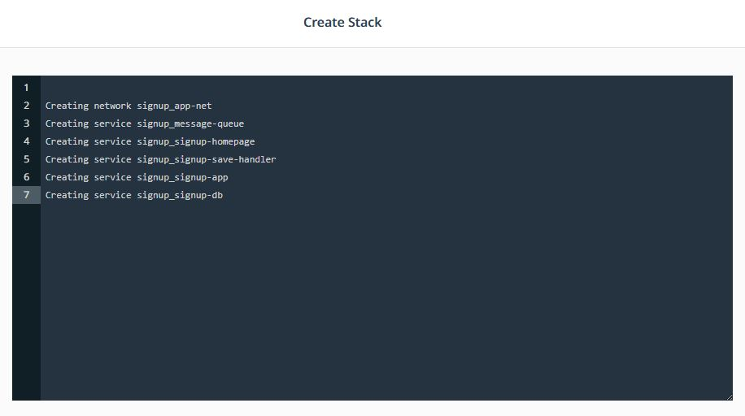
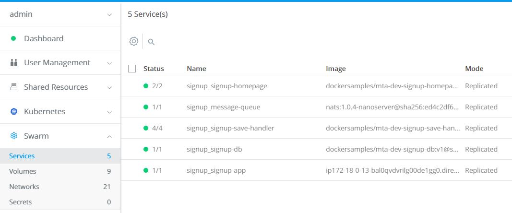

# Introduction 
This repo is copied from https://github.com/dockersamples/global-2018-hol/tree/master/mta-dotnet as of 12/2018.

It's purpose is to provide a solid application to experiement with .NET inside Jabil. 
These instructions are modified from Docker's original format to fit Jabil screens.

# Getting Started
To get started, please complete the Docker Training course provided by the Developer Services Team. 
While not required, it is strongly recommended.

In order to perform this lab, you will need to:
1.	Administrator rights on your machine
2.  Install Docker-CE for Windows
3.	Git for windows
4.	A non-IE web-browser (optional, but recommended)
5.	A choice Code Editor (Visual Studios Code is Recommended)
6.  A Powershell window run as Administrator

# Moving .NET/Windows Applications to Docker

You can run full .NET Framework apps in Docker on Windows containers. 
This hands-on lab shows you how to take an existing ASP.NET WebForms app, 
run it in Docker and then modernize the app by breaking features out and 
running them in separate containers.

The app you'll be using is modified from Docker's own video series 
[Modernizing .NET Apps for Developers](https://blog.docker.com/2018/02/video-series-modernizing-net-apps-developers/). 
This lab will get you experienced in using Docker to modernize traditional 
.NET applications, and then you can watch the video series for more in-depth walkthroughs.

> If you aren't familiar with the basic concepts of Docker, 
you can catch up by reviewing some of the self guided labs 
on the [Developer Services Site](https://jabil.sharepoint.com/sites/IT/DeveloperServices/Pages/Docker.aspx), 
or by reaching out to the Jabil Developer Team directly at 
[Docker@jabil.com](mailto:Docker@jabil.com).

## Table of Contents

* [Task 0: The Play with Docker Lab Environment](#0)
* [Task 1: Running the app in a container](#1)
* [Task 2: Fixing a performance issue](#2)
* [Task 3: Replacing the homepage](#3)
* [Task 4: Push Images to Docker Trusted Registry](#4)
* [Task 5: Deploy on Universal Control Plane](#5)

## <a name="0"></a>Step 0: The Docker EE Lab Environment

Login to the Docker Enterprise Edition session at the URL provided by your workshop organizer. 
This is a hybrid cluster, with Linux and Windows nodes. This workshop is designed for 
people attending an in-person workshop, but Steps 1-4 of this lab can be completed on your local 
machine, and then later pushed to Jabil's Docker Environmentvfor Step 5.

The left-hand navigation lists all the features avaiable to this UCP. Click on 'Shared Resources' 
and then 'Nodes' to see all the environments in this Swarm. You should see a list of hostnames, 
with the corresponding role (of manager or worker), and with at least 1 worker that has Windows 
under OS/Arch. This is required for Step 5 to work. That will be the Windows worker node on the 
Swarm where this app will run when complete.


For this lab, we will need to use Powershell. Make sure Docker is running on your environment- 
it runs as a background Windows Service:

```powershell
Start-Service docker
```

If you have used this environment for other labs, first remove any existing containers:

```.term1
docker container rm --force $(docker container ls --quiet --all)
```

> To start with you'll work with the Windows node directly, but at the end of the lab you'll deploy to the cluster to see how to run applications in production with Docker Enterprise.

## <a name="1"></a>Task 1: Running the app in a container

You're going to start with an ASP.NET 3.5 WebForms app which is meant to be built in Visual Studio and run in IIS, and instead use Docker to build and run the app in a container.

You can package Windows server applications to run in Docker using existing deployment tools (like MSIs), or from source code. In this task you'll compile and package an ASP.NET app from source using Docker.

Start by cloning the Git repository for the sample app:

```.term1
git clone https://github.com/dockersamples/mta-netfx-dev.git
```

Switch to the source directory and checkout the `part-1` branch, which has the first version of the app::

```.term1
cd mta-netfx-dev

git checkout part-1
```

Version 1 uses containers for a SQL Server database and the ASP.NET app. You can build the Docker images for both containers using Docker Compose. First change to the application directory and build the images:

```.term1
cd app 

docker-compose -f .\docker-compose.yml -f .\docker-compose-build.yml build
```

> Compose merges the two input files. The first specifies the structure of the app and the second adds the build details. They're kept separate because they have different concerns, and this keeps them clean.

The Windows server in your lab environment doesn't have SQL Server, Visual Studio or even MSBuild installed - every step in the build process happens inside containers, using images which are packaged with the build toolchain.

While the images are building, have a look at the <a href="https://github.com/dockersamples/mta-netfx-dev/blob/part-1/docker/web/Dockerfile" target="_blank">Dockerfile for the Web application</a>. You'll see there are two stages. The first stage compiles the application using MSBuild:

```
FROM dockersamples/mta-dev-web-builder:3.5 AS builder
SHELL ["powershell", "-Command", "$ErrorActionPreference = 'Stop';"]

WORKDIR C:\src\SignUp.Web
COPY src\SignUp C:\src
RUN .\build.ps1
```

The `dockersamples/mta-dev-web-builder:3.5` image has .NET 3..5, MSBuild, NuGet and the Web Deploy packages installed, so it has the full toolchain to compile an ASP.NET 3.5 application. (Here's the <a href="https://github.com/dockersamples/mta-netfx-dev/blob/part-1/docker/web-builder/3.5/Dockerfile" target="_blank">Dockerfile for the build image</a>).

In the `builder` stage, the Dockerfile copies the source code into the image and just runs the existing <a href="https://github.com/dockersamples/mta-netfx-dev/blob/part-1/src/SignUp/SignUp.Web/build.ps1" target="_blank">build.ps1</a>) script. When this stage completes, the output is a published website folder, which will be available for later stages to use.

The second stage uses the `microsoft/aspnet:3.5` image as the base, which is a Windows Server Core image with IIS and ASP.NET 3.5 already configured:

```
FROM microsoft/aspnet:3.5-windowsservercore-10.0.14393.1884
SHELL ["powershell", "-Command", "$ErrorActionPreference = 'Stop';"]

WORKDIR C:\web-app
RUN Remove-Website -Name 'Default Web Site'; `
    New-Website -Name 'web-app' -Port 80 -PhysicalPath 'C:\web-app'

COPY --from=builder C:\out\web\SignUpWeb\_PublishedWebsites\SignUp.Web .
```

The `RUN` command sets up the website using PowerShell. The `COPY` instruction copies the published website from the builder stage.

You don't need Visual Studio or IIS installed to run the web app in a container, and you don't need SQL Server installed to run the application database, you'll do it all with Docker. 

When the build has finished, deploy the application using Docker Compose to the Windows Docker server:

```.term1
docker-compose up -d
```

Docker Compose will start containers for the database and the web app. The <a href="https://github.com/dockersamples/mta-netfx-dev/blob/part-1/app/docker-compose.yml" target="_blank">compose file</a> configures the services, using the database image and the application image you've just built.

When the `docker-compose` command completes, your application is running in Docker, in Windows containers on the Windows node. You can see all the running containers:

```.term1
docker container ls
```

The HTTP port for the web container is published so the app is available to the outside world.

> To see the app running, browse to the Windows node hostname from the Session Information pane on the lab environment (an address like `ip172-18-0-11-bahdje2ubbhg0...play-with-docker.com`)


The application is a newsletter sign-up app for Play with Docker. It will take a little while to load because the app uses Entity Framework and on startup it deploys the database schema. The home page has some basic information and link buttons. Click the _Sign Up_ button and you'll see a registration form:


Go ahead and fill in the form. When you click _Go_, the data is saved to SQL Server running in a container. The SQL Server container doesn't publish any ports, so it's only accessible to other containers and the Docker API. 

Check your data is stored by switching back to the lab environment, and running a PowerShell command in the Windows terminal:

```.term1
docker container exec app_signup-db_1 powershell -Command "Invoke-SqlCmd -Query 'SELECT * FROM Prospects' -Database SignUpDb"
```

This executes a SQL query inside the SQL Server container, using the `Invoke-SqlCmd` cmdlet which is installed in the image.

The output is the result of the query - you'll see a row for each time you submitted the form, something like this:

```
ProspectId          : 1
FirstName           : Elton
LastName            : Stoneman
CompanyName         : Docker, Inc.
EmailAddress        : elton@docker.com
Role_RoleCode       : DA
Country_CountryCode : GBR
```

> The app is running fine in Docker, with no code changes from the original ASP.NET 3.5 codebase. The Dockerfile has all the logic to build and package the app, so any developer and all the CI servers can build and run the app from source - the only dependency is Docker.

Next you'll go on to modernize the app, fixing some issues with the current architecture.

## <a name="2"></a>Task 2: Fixing a performance issue

Right now the app makes a synchronous call to SQL Server when a new prospect signs up. While the app is looking up reference data and saving the new row, it has exclusive use of one of the connections in the database connection pool. You can scale up the web app by running many containers, but under high load the app will starve the connection pool and SQL Server becomes a bottleneck.

The next version of the app uses a new architecture:


Now when users save data, the web app publishes an event to a message queue. A message handler listens for those events and makes the SQL Server calls. This architecture does scale, because the message queue smooths out any peaks in traffic.

Switch to the `part-3` branch which has the new version of the app, and build it using Docker Compose:

```.term1
git checkout part-3

docker-compose `
  -f .\docker-compose.yml `
  -f .\docker-compose-local.yml `
  -f .\docker-compose-build.yml `
  build
```

While it builds, have a look at the <a href="https://github.com/dockersamples/mta-netfx-dev/blob/part-3/docker/web/Dockerfile" target="_blank">new Dockerfile for the web app</a>. The app has been upgraded from ASP.NET 3.5 to ASP.NET 4.7. The builder stage runs the build steps directly in Docker rather than using a PowerShell build script:

```
FROM dockersamples/mta-dev-web-builder:4.7.1 AS builder
SHELL ["powershell", "-Command", "$ErrorActionPreference = 'Stop';"]

WORKDIR C:\src\SignUp.Web
COPY .\src\SignUp\SignUp.Web\packages.config .
RUN nuget restore packages.config -PackagesDirectory ..\packages

COPY src\SignUp C:\src
RUN msbuild SignUp.Web.csproj /p:OutputPath=c:\out /p:DeployOnBuild=true
```

> Running the `nuget restore` and `msbuild` steps separately takes advantage of Docker's image layer cache. If the package file hasn't changed, the `nuget restore` layer gets loaded from the cache, saving an expensive operation in the build.

The new version of the code publishes an event from the web app to a message queue when a user signs up. There are some new lines in the application image stage, specifying values for environment variables:

```
ENV APP_ROOT="C:\web-app" `
    MESSAGE_QUEUE_URL="nats://message-queue:4222" `
    DB_CONNECTION_STRING_PATH=""
```

- `APP_ROOT` is the path where the application content gets stored in the image, stored in a variable because it gets used in multiple places

- `MESSAGE_QUEUE_URL` is the URL of the message queue. The web app uses an environment variable for this configuration, the default value expects to find the message queue in a container called `message-queue`

- `DB_CONNECTION_STRING_PATH` is the path to the .NET config file that contains the database connection string. The blank value means the app loads the default config file, but this enables the app to use Docker secrets for the connection string.

Docker Compose also builds a console application, which is the message handler listening for events. The <a href="https://github.com/dockersamples/mta-netfx-dev/blob/part-3/docker/save-handler/Dockerfile" target="_blank">Dockerfile for the message handler</a> is very similar to the web app - stage 1 compiles the console app, and stage 2 packages it to run in a Windows Server Core container.

When the build completes, run the new version of the app using Docker Compose:

```.term1
docker-compose `
  -f .\docker-compose.yml `
  -f .\docker-compose-local.yml `
  up -d
```

You'll see output saying that the database container is up-to-date, and then the message queue and message handler container get created, and the web container gets recreated. Compose uses the new specification as the desired state, compares it to the running containers, and creates any containers it needs.

The new website will be available on your same Windows Docker host. Browse to the Windows server as before - using the hostname from _Session Information_. You'll see the new homepage has been improved with an advert for DockerCon!



Click on the _Sign Up_ button and you'll see the UI and UX for the app is the same. Fill the form in again, and the website responds in the same way - but now the save is happening asynchronously through the message handler.

Check that your new data is there in the SQL Server container:

```.term1
docker container exec app_signup-db_1 powershell -Command "Invoke-SqlCmd -Query 'SELECT * FROM Prospects' -Database SignUpDb"
```

> You'll see both sets of details you saved because this version of the app uses the same database container as the last version.

And look at the logs for the message handler - you'll see entries showing that it has received a message and saved the data:

```.term1
docker container logs app_signup-save-handler_1
```

It's easy to add functionality to your app when it's running in Docker. This version of the app is using <a href="http://nats.io" target="_blank">NATS</a>, an open-source production-grade message queue. The NATS team publish an official Docker image which means you can add messaging to your app just by running a container.

> This version of the app does scale. You could run dozens of web containers and just a handful of message handler containers. Under high load, the message queue will retain messages until the handlers have capacity to process them - and SQL Server is no longer a bottleneck.

In the next task you'll extract the homepage functionality from the app and run it in a separate container.

## <a name="3"></a>Task 3: Replacing the homepage

Product owners often want to change UI features quickly - so they can release them and get fast feedback. Traditional apps make that difficult because the monolithic codebase means you need to do a lot of regression testing, even for simple changes.

Extracting a frequently-changing feature from the monolith and running it in a separate container enables fast, safe updates. You can change the UI by replacing the container, without having to test the rest of the monolith.

Switch to the `part-5` branch and build the new version of the app using Docker Compose:

```.term1
git checkout part-5

docker-compose `
  -f .\docker-compose.yml `
  -f .\docker-compose-local.yml  `
  -f .\docker-compose-build.yml `
  build
```

The <a href="https://github.com/dockersamples/mta-netfx-dev/blob/part-5/app/docker-compose.yml" target="_blank">compose file for part 5</a> adds one new component, a custom homepage container. The <a href="https://github.com/dockersamples/mta-netfx-dev/blob/part-5/docker/homepage/Dockerfile" target="_blank">Dockerfile for the homepage</a> is very simple:

```
FROM microsoft/iis:nanoserver-sac2016
COPY .\docker\homepage\index.html C:\inetpub\wwwroot
```

This just packages a static HTML file on top of the `microsoft/iis` image, running in Nano Server. There's a code change in ASP.NET app too. In this version the <a href="https://github.com/dockersamples/mta-netfx-dev/blob/part-5/src/SignUp/SignUp.Web/Default.aspx.cs" target="_blank">Default.aspx.cs codebehind</a> loads the homepage content from the new component.

When the build completes, run the new version of the app using Docker Compose:

```.term1
docker-compose `
  -f .\docker-compose.yml `
  -f .\docker-compose-local.yml `
  up -d
```

You'll see that a new homepage container gets started, and the web app container gets replaced with a new container. 

> There are some other containers started too, they're part of the [MTA .NET video series](https://blog.docker.com/2018/02/video-series-modernizing-net-apps-developers/), but you don't need to use them here.

The new version is available on your same Windows Docker host. Browse to the Windows server as before - using the hostname from _Session Information_.

Now when the ASP.NET web container receives a request, it calls out to the homepage container which renders the new homepage. That new homepage is a modern UI written in Vue.js:


If the product team don't like the new UI, they can easily replace it by building a new homepage and replacing the homepage container. The web app container doesn't need to change, so there are no regression tests to run.

> The app has a modern architecture now, powered by Docker and without needing a full rewrite. You've extracted key features from the app and run them in separate containers, using Docker to plug everything together, and to give you a consistent build and deployment process for the whole solution.

So far you've been running the application using Docker on the Windows node. Next you'll learn how to push the images to a private registry and run the app in a cluster with Docker swarm mode.

## <a name="4"></a>Step 4: Push Images to Docker Trusted Registry

Now that the images are built, you'll push them to Docker Trusted Registry (DTR). DTR is the enterprise-grade image storage solution from Docker. You install it behind your firewall so that you can securely store and manage the Docker images you use in your applications and to make them available on Docker Universal Control Plane (UCP).  UCP is the enterprise-grade cluster management solution from Docker and it helps you manage your Docker cluster and applications through a single interface.

Your lab environment already has DTR and UCP running. Your URL for DTR is in the Session Information panel, together with the password for the `admin` user to use. 

The DTR domain will be something like `ip172-18-0-22-bahe6raubbhg0095k710.direct.ee-beta2.play-with-docker.com`. To make it easier to work with, store that domain in an environment variable:

```
$env:dtrDomain='<your-dtr-domain-name>'
```

> Be sure to use your actual DTR domain name, which you can copy from the Session Panel.

Now log in in to your DTR instance with your `admin` credentials:

```
docker login "$env:dtrDomain" --username admin
```


DTR is a private registry. To push images to a registry other than Docker Hub, you need to tag them with the registry's domain name. 

Tag the new web homepage image you've built with a new name that includes the DTR domain and the `dockersamples` organization:

```
docker image tag `
  dockersamples/mta-dev-signup-homepage:v1 `
  "$($env:dtrDomain)/dockersamples/mta-dev-signup-homepage:v1"
```

Next you need to create an organization to group image repositories for the images you want to store. First click on the `DTR` button the left sidebar and log into DTR using the same `admin` credentials in the Session Information panel (**ignore the security warnings - the lab environment uses self-signed HTTPS certificates**).

Click on the _Organizations_ link on the left-hand navigation, and then the _New organization_ button:


And then name the organization `dockersamples`:


Save the organization, then click on the `dockersamples` organization and browse to the _Repositories_ tab:


Click the _Add repository_ button and create a repository called `mta-dev-signup-homepage` with the default settings:


> Organizations and repositories in DTR give you fine-grained control over who can push and pull images. Your `admin` account has full access, but you could create a test team who only had access to pull images for testing.

Images with your DTR domain in the tag will be pushed to your registry. Switch back to the lab environment and the Windows terminal. You have already logged in as the `admin` user so you have access - push the web application image:

```
docker image push `
  "$($env:dtrDomain)/dockersamples/mta-dev-signup-homepage:v1"
```

The push uploads all the image layers except the base Windows Server layer, which is always served from Docker Hub.

When the push completes you can see the image in DTR in the _Images_ tab of the _Repository_ windows:


The web image is now stored in a private registry with rich access controls, and features for security scanning and digital signing of images. The image is also available to use in Universal Control Plane.

> In production projects this step would be done by the CI process. In this lab you've just pushed one image to see how DTR works. The other images for the lab are all publicly available on Docker Hub.

## <a name="5"></a> Step 5: Deploy on Universal Control Plane

Your lab environment has a Docker Enterprise cluster set up, but the Windows node is not yet part of the cluster. Open the terminal window for the `manager1` node and get the join token for adding new nodes to the swarm:

```
docker swarm join-token worker
```


Copy the full `docker swarm join` command with the long token to the clipboard. Then switch back to the Windows terminal. When the image push has completed, paste the command to join the Windows node to the UCP cluster:


Now we can switch to the UCP UI. Click on the UCP button to launch the UCP window.

> DTR and UCP have single sign-on support so you don't need to log in again - in a production environment you can also use your existing AD or LDAP provider for authentication.

Next you'll deploy the application using Docker swarm mode as the orchestrator. The latest version of Docker Enterprise supports Kubernetes, but Windows containers are still in beta with Kubernetes, so we will use swarm mode. 

The application image in DTR is private, only authenticated users can access it. UCP can pull a private image onto all nodes in the cluster. On the left-navigation panel, click _Shared Resources_ and then _Images_. You'll see all the images currently pulled on the cluster. Click _Pull Image_ to pull the app image from DTR:


Enter your user credentials and the image name **including your full DTR domain**, so in my case I enter:

```
ip172-18-0-12-bao29l5plqdg00dpiv60.direct.beta-hybrid.play-with-docker.com/dockersamples/mta-dev-signup-homepage:v1
```


> Be sure to use your DTR domain name, or the image won't load and you won't be able to run the app.

UCP authenticates with DTR and pulls the image onto all nodes. You will see some `failed pull` messages in the output, because UCP does not know this is a Windows image and it tries to pull it to the Linux nodes to, where it fails. When the pull completes, click the _Done_ button:



Now you're ready to deploy the app to your production cluster! 

On the left-navigation panel, click _Shared Resources_ and then _Stacks_. This shows all the stacks running on the cluster on any orchestrator - UCP supports classic swarm, swarm mode and Kubernetes. Click the _Create Stack_ button to deploy a new stack:



You can upload a Docker Compose YAML file, or paste in the contents. You'll need to paste in the sample YAML file and update the app image name to add your DTR repository.

Open the [compose file](./docker-stack.yml) and copy the contents to the clipboard. Then paste the YAML into the UCP _Ceate Stack_ and update the image name for the app service.

The YAML starts like this:

```
version: '3.3'
services:

  signup-homepage:
    image: <your-dtr-domain>/mta-dev-signup-homepage:v1
```

You will need to replace `<your-dtr-domain>` with your actual DTR domain, so the image name matches the image you pulled from DTR:



Call the stack `signup`, and select `Swarm Services` for the deployment mode. Click _Create_ to deploy the stack. You will see output telling you that all the services have been created:



Now on the left-hand navigation select _Swarm_ and _Services_. The page shows you all the services for the application. The services show a green light when all containers are running - this will take a few moments while the images are downloaded and containers are scheduled on the Windows node.

Soon all the services will be running at 100%:



The new version is available on your same Windows Docker host. Browse to the Windows server as before - using the hostname from _Session Information_.

Here there are 9 containers running as swarm services for my application, and with Docker Enterprise you can also run Linux containers as a Kubernetes stack. You use DTR to ship, scan and sign all your images, and UCP to manage all your apps - a consistent platform for any type of application.